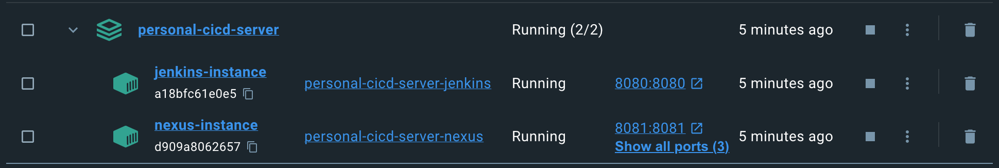

# CI/CD Environment with Jenkins and Nexus using Docker Compose

This repository contains a docker-compose file to create a CI/CD environment with Jenkins and Nexus using Docker Compose.

This repository contains a Docker Compose configuration for setting up Jenkins and Nexus containers. It allows you to quickly spin up a local development environment with these CI/CD tools.

## Prerequisites

Make sure you have Docker and Docker Compose installed on your machine before proceeding.

## Screenshots



## Usage

1. Clone this repository to your local machine:

   ```shell
   git clone git@github.com:dcfrancisco/personal-cicd-server.git
   ```

2. Navigate to the cloned directory:

   ```shell
   cd personal-cicd-server
   ```

3. Start the containers using Docker Compose:

   ```shell
   docker-compose up -d
   ```

   This command will download the required Docker images and start the Jenkins and Nexus containers in the background.

4. Access Jenkins:

   Open your web browser and visit [http://localhost:8080](http://localhost:8080). This will take you to the Jenkins web interface.

Initial setup is required to unlock Jenkins and install the recommended plugins. To do this, you need to retrieve the initial admin password from the Jenkins container. You can do this by running the following command:

```shell
docker exec jenkins-instance cat /var/jenkins_home/secrets/initialAdminPassword
```
or

This may also be found at: /var/jenkins_home/secrets/initialAdminPassword

1. Access Nexus:

   Open your web browser and visit [http://localhost:8081](http://localhost:8081). This will take you to the Nexus web interface.

    ```
    /nexus-data/admin.password
    ```
2. Perform any additional configurations or setups required for Jenkins and Nexus as per your needs.

3. When you're finished, stop the containers using Docker Compose:

   ```shell
   docker-compose down
   ```

   This command will stop and remove the containers, but preserve the Jenkins data volume for future use.

## Configuration

The Docker Compose configuration consists of two services: Jenkins and Nexus. Each service is defined with its own set of configurations.

### Jenkins

- Docker image: Built using the `./jenkins` context
- Container name: `jenkins-instance`
- Ports:
  - Jenkins web interface: 8080 (mapped to the host machine)
- Volumes:
  - `jenkins-data`: Stores Jenkins configuration and data

### Nexus

- Docker image: Built using the `./nexus` context
- Container name: `nexus-instance`
- Exposed ports: 8081, 8082, 8083
- Ports:
  - Nexus web interface: 8081 (mapped to the host machine)
- Volumes:
  - `./volume:/nexus-data`: Stores Nexus configuration and data

## Volumes

- `jenkins-data`: A named volume used by the Jenkins service to persist configuration and data. This volume is created automatically by Docker Compose.

## Additional Information

- Both Jenkins and Nexus containers are set to automatically restart (`restart: always`) in case of any failures or system restarts.

Feel free to modify the configurations as per your requirements. For more information and advanced usage of Docker Compose, refer to the official documentation.
