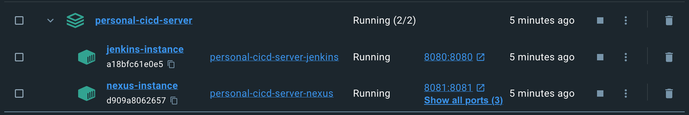

````markdown
# CI/CD Environment with Jenkins, Nexus, GitLab, and SonarQube using Docker Compose

This repository contains a docker-compose file to create a comprehensive CI/CD environment with Jenkins, Nexus, GitLab, and SonarQube using Docker Compose.


> ☕ Keep me caffeinated so I can keep debugging things you won’t have to — [buy me a coffee](https://www.buymeacoffee.com/dcfrancisco) 🙌


## Prerequisites

Make sure you have Docker and Docker Compose installed on your machine before proceeding.

## Screenshots



## Usage

### Quick Start (Fully Automated)

The easiest way to get everything running:

```shell
# Clone the repository
git clone git@github.com:dcfrancisco/personal-cicd-server.git
cd personal-cicd-server

# Run the automated setup and start all services
./start.sh
```

This script will:
- ✅ Create all necessary volume directories
- ✅ Check Docker and Docker Compose installation
- ✅ Build custom Docker images
- ✅ Start all containers
- ✅ Wait for services to be healthy
- ✅ Display access information

### Manual Setup

If you prefer to run commands manually:

## Configuration

The Docker Compose configuration consists of four main services: Jenkins, Nexus, SonarQube, and GitLab. Each service is defined with its own set of configurations.

### Jenkins

- Docker image: Built using the `./jenkins` context
- Container name: `jenkins-instance`
- Ports:
  - Jenkins web interface: 8080 (mapped to the host machine)
- Volumes:
  - `jenkins-data`: Stores Jenkins configuration and data
- Plugins included:
  - Git, Workflow, Docker, Credentials, SonarQube, GitLab integration

### Nexus

- Docker image: Built using the `./nexus` context
- Container name: `nexus-instance`
- Exposed ports: 8081, 8082, 8083
- Ports:
  - Nexus web interface: 8081 (mapped to the host machine)
- Volumes:
  - `./volume:/nexus-data`: Stores Nexus configuration and data

### SonarQube

- Docker image: Built using the `./sonarqube` context
- Container name: `sonarqube-instance`
- Port: 9000
- Database: PostgreSQL (separate container)
- Volumes:
  - `sonarqube-data`: SonarQube data directory
  - `sonarqube-logs`: SonarQube logs
  - `sonarqube-extensions`: SonarQube extensions/plugins

### PostgreSQL (for SonarQube)

- Docker image: `postgres:15-alpine`
- Container name: `postgres-instance`
- Database credentials:
  - Username: `sonarqube`
  - Password: `sonarqube_password`
  - Database: `sonarqube`
- Volumes:
  - `postgres-data`: PostgreSQL data directory

### GitLab

- Docker image: `gitlab/gitlab-ee:latest`
- Container name: `gitlab-instance`
- Ports:
  - HTTP: 80
  - SSH: 2222
- Volumes:
  - `gitlab-config`: GitLab configuration
  - `gitlab-data`: GitLab data
  - `gitlab-logs`: GitLab logs
- Default credentials:
  - Username: `root`
  - Password: `gitlabadmin123`

## Volumes

- `jenkins-data`: Jenkins configuration and data
- `sonarqube-data`: SonarQube data
- `sonarqube-logs`: SonarQube logs
- `sonarqube-extensions`: SonarQube extensions
- `postgres-data`: PostgreSQL data
- `gitlab-config`: GitLab configuration
- `gitlab-data`: GitLab data
- `gitlab-logs`: GitLab logs

## Additional Information

- Both Jenkins and Nexus containers are set to automatically restart (`restart: always`) in case of any failures or system restarts.

Feel free to modify the configurations as per your requirements. For more information and advanced usage of Docker Compose, refer to the official documentation.

## Helper Scripts

The repository includes helper scripts to manage the CI/CD environment:

### start.sh
Complete automated setup and startup of all services.

```shell
./start.sh
```

### stop.sh
Safely stop all running services while preserving data.

```shell
./stop.sh
```

### status.sh
Check the status of all services and get diagnostic information.

```shell
./status.sh
```

### setup.sh
Initialize volume directories and create configuration files.

```shell
./setup.sh
```

## Service Details & Access

| Service | URL | Port | Credentials |
|---------|-----|------|-------------|
| **Jenkins** | http://localhost:8080 | 8080 | Retrieved from container |
| **Nexus** | http://localhost:8081 | 8081 | Check admin.password file |
| **SonarQube** | http://localhost:9000 | 9000 | admin / admin |
| **GitLab** | http://localhost | 80 | root / gitlabadmin123 |
| **GitLab SSH** | ssh://localhost:2222 | 2222 | root / gitlabadmin123 |
| **PostgreSQL** | localhost | 5432 | sonarqube / sonarqube_password |

## Data Persistence

All data is persisted in the `./volume/` directory:

```
volume/
├── jenkins/              # Jenkins home directory
├── nexus/                # Nexus repository data
├── sonarqube/
│   ├── data/             # SonarQube data
│   ├── logs/             # SonarQube logs
│   └── extensions/       # SonarQube plugins
├── postgres/             # PostgreSQL database
└── gitlab/
    ├── config/           # GitLab configuration
    ├── data/             # GitLab data
    └── logs/             # GitLab logs
```

Data is preserved even when containers are stopped or removed.

## Troubleshooting

### Services won't start
- Ensure Docker and Docker Compose are installed
- Check available disk space
- Try rebuilding images: `docker-compose build --no-cache`

### Can't access a service
- Wait a few minutes for GitLab to start (it takes time)
- Check service logs: `docker-compose logs -f [service-name]`
- Verify ports aren't already in use on your system

### Database connection issues
- PostgreSQL must be running before SonarQube
- Check that credentials in docker-compose.yml match

### Reset everything
```shell
docker-compose down -v
rm -rf volume/
./start.sh
```

## License

This project is licensed under the [MIT License](LICENSE).
````